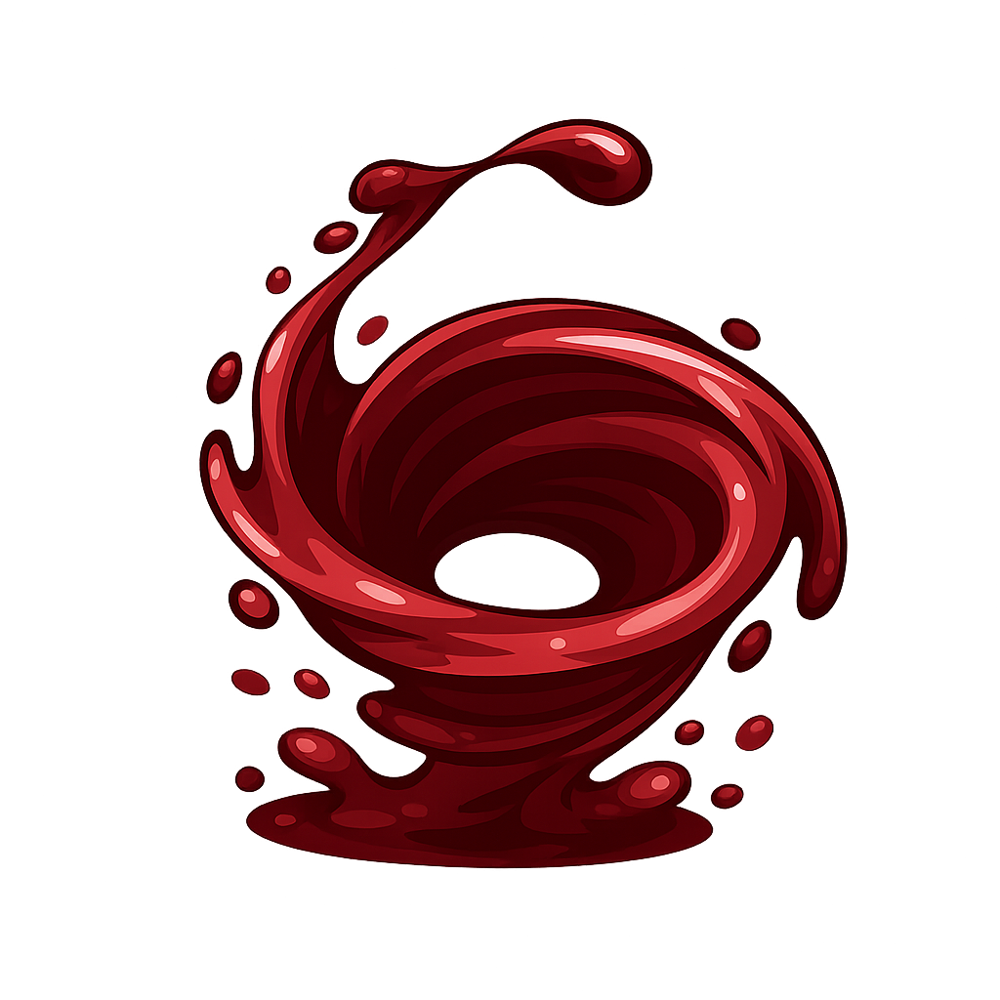

<p align="center">

# VortexTricks

**Automate Vortex Mod Manager setup in Linux for Steam & Heroic**

VortexTricks is a lightweight, self‑contained Python utility that

* Detects your Steam and Heroic installations
* Resolves duplicate titles between your Steam and GOG libraries
* Creates the necessary WINE prefix(es)
* Registers the games inside Vortex by adding the correct registry keys and
  creating save‑game / `AppData` symlinks
* Downloads and installs the latest Vortex release

> ⚠️ **Disclaimer** – This project is provided as-is. Use it at your own risk.

---

## Table of Contents

1. [Features](#features)
2. [Prerequisites](#prerequisites)
3. [Installation](#installation)
4. [Usage](#usage)
5. [Manual Post‑Execution Steps](#manual-postexecution-steps)
6. [Extending the Game Registry](#extending-the-game-registry)
7. [Troubleshooting](#troubleshooting)
8. [Contributing](#contributing)
9. [Star History](#star-history)

---

## Features

| Feature | Description |
|---------|-------------|
| **Store detection** | Automatically locates Steam and Heroic (GOG) installations. |
| **Duplicate handling** | Prompts you to decide which copy to keep or to use separate bottles. |
| **Bottle creation** | Creates a default `Vortex` bottle, or separate ones per store, with the appropriate WINE runner. |
| **Registry registration** | Adds the required Windows registry entries for each game into the Vortex prefix. |
| **Symlink creation** | Links the Proton prefix’s `My Games` & `AppData` folders into the Vortex WINE prefix so that saves and settings stay in sync. |
| **Automatic Vortex install** | Downloads the latest Vortex installer from GitHub and installs it into the chosen prefix. |

---

## Prerequisites

### Software

| Item | Requirement | Notes |
|------|-------------|-------|
| **Linux** | Any | Tested with Fedora Linux 43 and 44 |
| **Python** | 3.9+ | Tested with 3.14 |
| **Bottles** | Required | Required for running Windows binaries |
| **Flatpak** | Required | Required for Bottles |
| **Steam** | Optional | Required for Steam games |
| **Heroic Games Launcher** | Optional | Required for GOG games |
| **`protontricks`** | pip package | Used to find Steam |
| **`requests`** | pip package | For downloading the Vortex installer |
| **`jsonschema`** | pip package | For validating `gameinfo.json` |

### Game initialization
  Any game to be modded needs to be ran once before attempting to mod it.  Otherwise, missing files may cause errors in Vortex.  If you forget to add one of your games or install a new game later, you can just re-run `vortextricks.py` after initializing the new game.

---

## Installation

```bash
# Clone the repo
git clone https://github.com/gsquarediv/vortextricks.git
cd vortextricks

# Create a virtual environment (recommended)
python -m venv venv
source venv/bin/activate

# Install dependencies
python -m pip install -r requirements.txt
```

---

## Usage

```bash
source venv/bin/activate # if not already activated
./vortextricks.py
```

⚠️ **Reboot** before launching Vortex

Upon execution, this script will:

1. Detect Steam and GOG game libraries.
2. Prompt you if the same title appears in both libraries.
3. Ask whether to use the Steam copy, the GOG copy, or keep both in separate bottles.
4. Create the necessary bottles or WINE prefixes.
5. Register Windows registry entries for each game to enable auto-detection of the game path in Vortex.
6. Create symlinks for `My Games` & `AppData`.
7. Download and install Vortex if not present.

### Command‑Line Options

At the moment the script has no command‑line arguments.

---

## Manual Post‑Execution Steps

After the script finishes, you may need to perform a few manual steps to complete the setup:

- **Mod staging folder**  
  Vortex needs a staging folder where it temporarily stores mods before deploying them.  When running Vortex in Bottles (Flatpak), the default suggestions seem to work pretty well.  You may be able to simply enable "Automatically use suggested path for staging folder" in Settings and let Vortex handle it.  If that does not work, you will have to manually set your staging folder.

---

## Extending the Game Registry

The registry of known games is stored in `gameinfo.json`.  
To add a new game:

1. Add an entry in the array, e.g.:

```json
{
  "name": "Example Game",
  "game_id": "examplegame",
  "steamapp_ids": ["123456"],
  "gog_id": "987654321",
  "ms_id": null,
  "epic_id": null,
  "registry_entries": {
    "HKEY_LOCAL_MACHINE\\Software\\ExampleCompany\\ExampleGame": "Installed Path"
  },
  "override_mygames": "ExampleGame",
  "override_appdata": "ExampleGame"
}
```

2. Validate the JSON against the schema:

```bash
python -c "import jsonschema, json, pathlib; schema = json.load(open('gameinfo.schema.json')); validator = jsonschema.Draft202012Validator(schema); json.load(open('gameinfo.json'))" || echo "Invalid JSON"
```

3. Rerun the script – the new game will now be recognized.

> **Tip** – The `registry_entries` dictionary key is the full registry path; the value is the name of the key.  `vortextricks.py` will insert the game path as the value of the key.

---

## Troubleshooting

| Symptom | Cause | Fix |
|---------|-------|-----|
| ModuleNotFoundError | Virtual environment not active or requirements not installed | See [Installation](#installation) |
| RuntimeError: Could not locate bottles-cli | [Prerequisites](#prerequisites) not installed. | Install Bottles via `flatpak install com.usebottles.bottles` |
| Duplicate game prompts not showing | The duplicate detection logic didn’t find overlapping game IDs | Ensure both game IDs are in `gameinfo.json` |
| Vortex UI is not scaled properly | Your desktop environment has implemented user interface scaling in a retarded way | Try running Vortex with `--force-device-scale-factor=2` |
| Vortex window does not render properly | OpenGL errors | Try any of the following: <ul><li> `__EGL_VENDOR_LIBRARY_FILENAMES=/usr/share/glvnd/egl_vendor.d/10_nvidia.json` (Nvidia only) <li> Set Renderer to GDI in Bottles <li> `winetricks renderer=gdi` <li> `Vortex.exe --disable-gpu` </ul> |
| fallout.ini keeps getting reset when launching the game | FalloutNVLauncher.exe is being launched instead of nvse_loader.exe | Use the following launch option: `bash -c "DO=(%command%); \"\${DO[@]/%FalloutNVLauncher.exe/nvse_loader.exe}\""` |

---

## Contributing

1. Fork the repository.
2. Create a new branch.
3. Commit your changes with descriptive messages.
4. Push the branch and open a pull request.

---

## Star History

[](https://www.star-history.com/?repos=gsquarediv%2Fvortextricks&type=date&legend=bottom-right)
